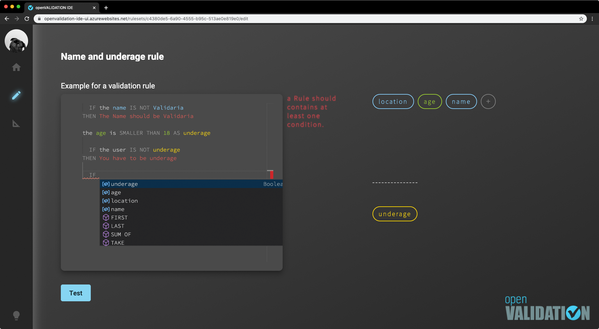
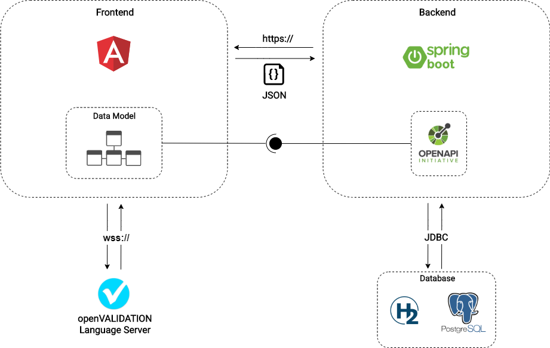

# openVALIDATION-IDE
<p align="center">
  <a href="" rel="noopener">
 </a>
</p>

<p align="center">
<a href="https://openvalidation-ide-ui.azurewebsites.net" target="_blank">Demo IDE</a> | <a href="https://docs.openvalidation.io/contribution/developer-guide/ide" target="_blank">Documentation</a>
<br/><br/>
  integrated development environment for <a href="https://github.com/openvalidation/openvalidation">openVALIDATION </a>
</p>

<p align="center">
<a href="https://hub.docker.com/r/openvalidation/openvalidation-ide-ui">

</a>
<a href="https://hub.docker.com/r/openvalidation/openvalidation-ide-backend">

</a>
<p>


## contents
* [introduction](#introduction)
* [architecture overview](#architecture-overview)
* [run with docker](#run-with-docker)
* [run local](#run-local)
  * [prerequisites](#prerequisites)
  * [commands](#commands)
  * [environmental variables](#environmental-variables)

## introduction
openVALIDATION-IDE is a web-based development environment for users who are not familiar with coding. It enables Domain Experts, Business Analysts or Requirement Engineers to write complex validation rules themselves using natural language. These validation rules will be translated into code using [openVALIDATION](https://github.com/openvalidation/openvalidation).

Usually, an IDE is a very technical tool for coding. The openVALIDATION-IDE is an approach to hide all the technical features of an IDE and gives the user just the necessary tools for writing validation rules. It includes features like syntax highlighting, auto-completion and linting while making it look like a simple text-editor.

The major components of the tech stack for the openVALIDATION-IDE consists of the [Angular framework](https://angular.io/) and the [Monaco Editor](https://microsoft.github.io/monaco-editor/) for its UI, while backend functionality is powered by [Spring Boot](https://spring.io/projects/spring-boot).

## architecture overview
The following overview describes the technology used as well as the way the components communicate with each other.



## run with docker
You can easily run the openVALIDATION-IDE on your local machine with docker, following these steps:
1. [Install docker](https://docs.docker.com/get-docker) if not already installed
2. Clone this repository with `git clone https://github.com/openvalidation/openvalidation-ide`
3. Navigate into the previously cloned repository with `cd openvalidation-ide`
4. Run `docker-compose up`
5. Open [localhost](http://localhost/) in your browser

If you don't want to download and compile the sources however, you can also just pull the latest images directly from dockerhub using [this alternative docker-compose file](openvalidation-ide-dockerhub.yml):
1. [Install docker](https://docs.docker.com/get-docker) if not already installed
2. Download [openvalidation-ide-dockerhub.yml](openvalidation-ide-dockerhub.yml) to your machine
3. Run `docker-compose -f openvalidation-ide-dockerhub.yml up`
4. Open [localhost](http://localhost/) in your browser

## run local
### prerequisites
To run the project locally, the following tools must be installed:
* Required installations for the frontend:
  1. Install a supported version of [node.js](https://nodejs.org/en/) if not already installed
  2. [Install Angular CLI](https://angular.io/cli) tool using npm package manager:
     ```
     npm install -g @angular/cli
     ```
* Required installations for the backend:
  1. [Install Java SE Development Kit 8](https://www.oracle.com/java/technologies/javase/javase-jdk8-downloads.html)
  2. [Download](http://maven.apache.org/download.cgi) and [install](http://maven.apache.org/install.html) Apache Maven
* [Install and run the openVALIDATION Language Server](https://github.com/openvalidation/openvalidation-languageserver#getting-started)

### commands
1. Clone this repository with `git clone https://github.com/openvalidation/openvalidation-ide`
3. Navigate into the previously cloned repository with `cd openvalidation-ide`
2. Run the frontend:
   1. Navigate into frontend directory with `cd ./frontend/`
   2. Install node dependencies:
      ```
      npm install
      ```
   3. Start local angular frontend:
      ```
      ng serve
      ```
3. Run the backend:
   1. Navigate into backend directory with `cd ./backend/`
   2. Start backend with in-memory h2 database
      ```
      mvn clean spring-boot:run -Dspring-boot.run.arguments=--cors-headers=http://localhost:4200
      ```
4. Open [localhost](http://localhost:4200/) with your local angular port (default: 4200) in your browser


## environmental variables
These can be set in the docker-compose file or when the container is started.
### frontend
| Variable | Default Value | Description |
| :--- | :--- | :--- |
| API\_BASE\_PATH | http://127.0.0.1:8080 | URL of the IDE Backend |
| LANGUAGE\_SERVER\_URL | ws://127.0.0.1:3010 | URL of the language-server |

### backend
| Variable | Default Value | Description |
| :--- | :--- | :--- |
| SPRING\_PROFILES\_ACTIVE | dev | Active Spring Profile |
| OPENVALIDATION\_IDE\_DB | postgres | Database technology |
| OPENVALIDATION\_IDE\_DB_NAME | | Database name |
| OPENVALIDATION\_IDE\_DB\_USER | | Database username |
| OPENVALIDATION\_IDE\_DB\_PW | | Database password |
| CORS\_HEADERS | | Allowed CORS Headers |
| RESET\_SECRET | | Secret for obfuscating /reset |
